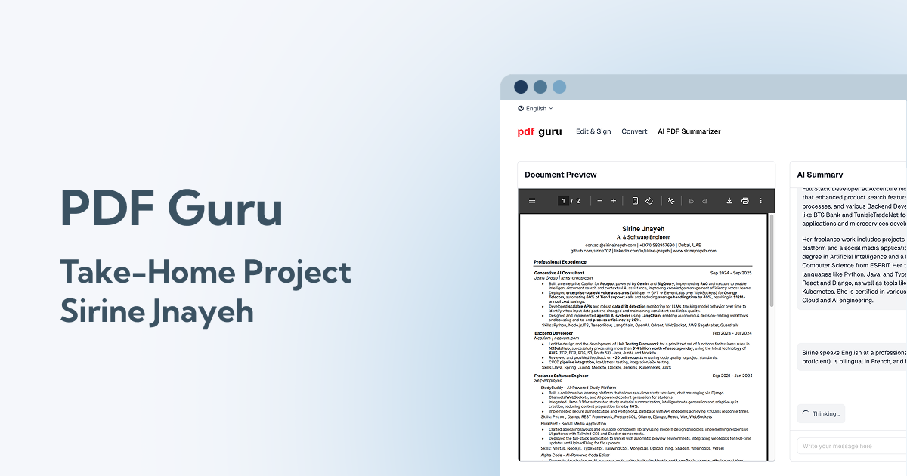

# PDF Guru Clone

A take-home project clone of **PDF Guru** developed for **PORTALAB IT**.



## About

This project is a functional clone of PDF Guru that demonstrates modern web development capabilities with PDF management features. Built as a technical assessment for PORTALAB IT, it showcases:

- **Edit & Sign PDFs**: Full-featured PDF editor with annotation, compression, splitting, merging, and signature capabilities
- **PDF Converter**: Convert PDFs to various formats (Word, Image, Excel, etc.) and vice versa
- **AI-Powered Summarizer**: Extract key insights and summaries from PDF documents using advanced AI

## Tech Stack

**Frontend:**

- **Framework**: Next.js with App Router
- **Language**: TypeScript
- **UI**: React, Tailwind CSS
- **PDF Processing**: Nutrient (PSPDFKit) Web SDK
- **Internationalization**: next-intl (English & French)

**Backend:**

- **Framework**: Express.js
- **Language**: TypeScript
- **Database**: PostgreSQL with Prisma ORM
- **Authentication**: JWT & bcrypt
- **AI**: OpenAI API
- **File Upload**: Multer
- **PDF Processing**: Convert API

## Getting Started

### Prerequisites

- Node.js 20+
- Yarn

### Installation

**Frontend:**

```bash
yarn # Install dependencies

yarn dev # Run development server
```

Note that PSPDFKit doesn't require an API key.

Open [http://localhost:3000](http://localhost:3000) to view the frontend app.

**Backend:**

Check [this repo](https://github.com/sirine707/pdfguru-clone-take-home-project-express) for the backend's code.

```bash
yarn # Install dependencies

# Create a .env file in the root directory based on .env.example

npx prisma migrate dev # Run database migrations

npx prisma generate # Generate Prisma client

yarn dev # Run development server
```

Note that Both OPENAI_API_KEY and CONVERT_API_KEY environment variables can be generated from their respective developer platforms.

Open [http://localhost:4000](http://localhost:4000) to view the backend app.

## Project Structure

**Frontend:**

```
/
├── app/                   # Next.js app directory
│   ├── [locale]/          # Internationalized routes
│   │   ├── converter/     # PDF converter module
│   │   ├── edit-sign/     # PDF editor module
│   │   └── summarizer/    # AI summarizer module
│   └── layout.tsx         # Root layout
├── components/            # React components
├── contexts/              # React contexts
├── lib/                   # Utilities and helpers
├── messages/              # i18n translations
├── public/                # Static assets
└── types/                 # TypeScript type definitions
```

**Backend:**

```
/
├── src/                   # Source code directory
│   ├── index.ts           # Express server entry point
│   ├── auth.ts            # Authentication routes & logic
│   ├── converter.ts       # PDF converter API routes
│   ├── summarizer.ts      # AI summarizer API routes
│   ├── db.ts              # Prisma database client
│   └── generated/         # Generated Prisma client
├── prisma/                # Database configuration
│   ├── schema.prisma      # Prisma schema definition
│   └── migrations/        # Database migrations
├── uploads/               # Uploaded PDF files storage
```

## Demo

[](https://youtu.be/E8hh81jDVac)

[Watch Demo Video](https://youtu.be/E8hh81jDVac)

## Follow-Up Work

- I didn't clone the app UIs and usage flows in a pixel-perfect way, but I can do so if required. I just wanted to demonstrate the challenging parts, which I believe are what matter most in this assessment.

- I could have created a separate bridge page for each tool under `/edit-sign` and `/converter` so that SEO could index them individually with their respective metadata, but I chose to keep it simple.

- Using the `tool` query parameter in `/edit-sign/editor`, I wanted to display a usage tip of PSPDFKit that depends on the selected tool.

- For analytics, I planned to integrate GA4 in a simple way, by creating a project on GCP and adding their script.

- I skipped the payment part as requested.

- Login authentication with JWT was properly implemented, including session persistence and retrieval on refresh. However, I didn't go beyond that, as the requirements only specified a basic authentication flow.
